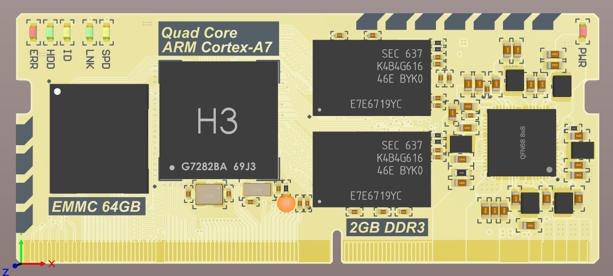
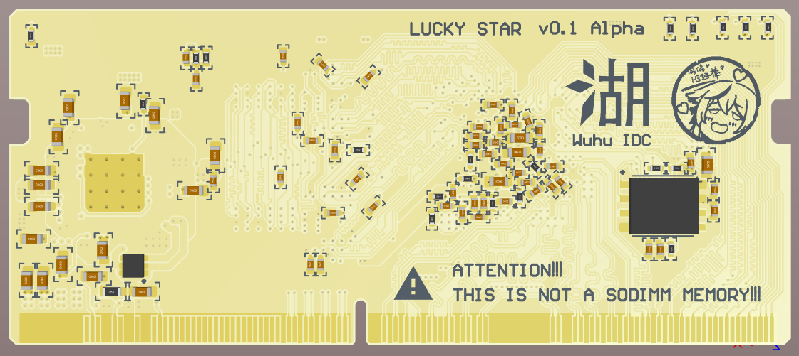

## Lucky Star H3
[Allwiner H3](https://www.allwinnertech.com/index.php?c=product&a=index&id=47) board with 2GB RAM and 64GB eMMC, **Full OpenSource**.  
We called it `LuckyStar-H3`, able to run Konata.Core on it effortlessly.

Compared with the Raspberry Pi, it has outstanding scalability and unparalleled computing power,  
which is very suitable for Cloud and Edge Computing.

## Overview

## U-Boot
Waiting for scheme verification.  
Stay tune :3

## License
Licensed under MIT with ❤.

## Special Thanks
- [@Angelic47](https://github.com/Angelic47)
- [@LXY1226](https://github.com/LXY1226)
